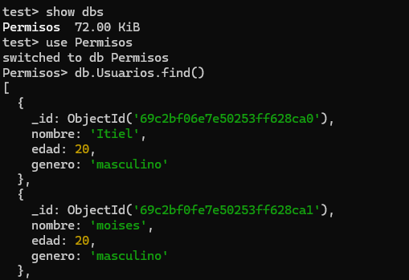
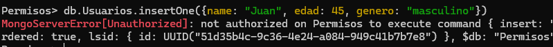
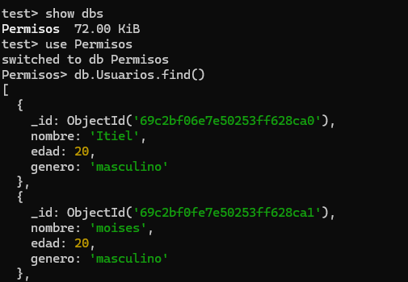
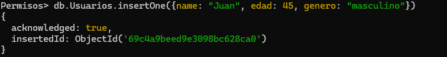
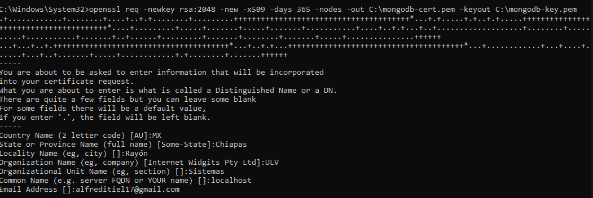

# Seguridad en MongoDB en Windows

## Habilitar autenticación
Para activar la seguridad debemos ubicarnos en la carpeta donde se instalo MongoDB, y abrir como administrador el archivo *mongo.cfg*.
Ya que estamos dendro vamos a ubicar la sección de seguridad y activarlo de la siguiente manera:

#Segurity
security:
  authorization: enabled

Guardamos y reiniciamos el servicio de MongoDB.

## Crear usuarios con roles y permisos
Accedemos a mongosh y accedemos a la db admin, dentro de ella crearemos el usuario de administrador. con el siguiente comando: 
*db.createUser({user: "adminUser", pwd: "contraseña!", roles: [{ role: "userAdminAnyDatabase", db: "admin" }]});*

Ahora al entrar a Mongo compas nos pedira la autenticación, pero en mongosh solicitad la autenticación al realizar alguna operación mostrara el siguiente mensaje:
**MongoServerError[Unauthorized]: Command listDatabases requires authentication**

Para aceder a mongosh necesitamos utilizar comandos extras de autenticación: 

*mongosh -u nameUser -p password --authenticationDatabase namedb*

Esto se utiliza sin importal el usuario.

para hacer las pruebas creamos a dos usuarios uno de solo lectura, y otro de lectura y escritura, para verificar sus permisos.

<table>
<tr>
<td>

Solo lectura

Al ejecutar comandos de insertar nos avisará que no se puede realizar la acción por que no tenemos permisos.

</td>
<td>

Lectura y escritura

Al realizar comandos de escritura, los realiza y nos da la confirmación con el id del documento, por que este usuario tiene ambos permisos.

</td>
</tr>
</table>

Con esto, verificamos:
1. Solo pueden ver la BD a la que estan asignados.
2. Los roles delimitan las acciones que pueden realizar.

## Configuración de conexiones seguras
Primero descargamos OpenSSL lo haremos desde el siguiente enlace:
*https://slproweb.com/products/Win32OpenSSL.html*, ya que lo descargamos buscaremos dentrop de la carpetsa donde se intalo, la carpeta bin, copiamos la ruta ya la agrgamos en las variables de entorno: en mi caso la ruta fue la siguiente: *D:\Program Files\OpenSSL-Win64\bin* reiniciamos la terminal y ejecutamos openssl version para verificar que si este instalado correctamente.

Ya que tenemos lo anterior es necesario crear el sertificado y la clave privada, en la terminal (administrador) ejecutamos *openssl req -newkey rsa:2048 -new -x509 -days 365 -nodes -out C:\mongodb-cert.pem -keyout C:\mongodb-key.pem* y nos solicitara unos:

y verificamos con el siguiente comando *dir C:\mongodb*.pem* que se ayan creado los archivos: 
- C:\mongodb-cert.pem
- C:\mongodb-key.pem

Utilizamnos el siguiente comando para combinar ambas en un solo archivo *type C:\mongodb-key.pem C:\mongodb-cert.pem > C:\mongodb.pem*

En nuestro mongod.cfg editamos la parte de net: de la siguiente manera:
net:
  port: 27017
  bindIp: 127.0.0.1

  tls:
    mode: requireTLS
    certificateKeyFile: C:\mongodb.pem
    CAFile: C:\mongodb.pem
    allowConnectionsWithoutCertificates: true

utilisamos tsl y no ssl, poe cuestiones de la verción en MongoDB 8. Lo guardamos y detenemos mongoDB
- net stop MongoDB

lo siguente es desabilitar la autenticacion que se habia habilitado anteriormente: 
#security:
 #authorization: enabled
o comentarla como en este caso, despues iniciamos mongo en una terminal como administrador: *"C:\Program Files\MongoDB\Server\8.2\bin\mongod.exe" --config "C:\Program Files\MongoDB\Server\8.2\bin\mongod.cfg"*

y en otra terminal entramos a *mongosh --tls --host localhost --tlsCAFile C:\ca.pem* ya teniendo eso, volvemos a crear un usuario admin, asi como se realizó anteriormente y volvemos activar la segurity en el archuvi de *mongod.cfg*

procedemos a reiniciar mogo
- net stop MongoDB
- net start MongoDB

### Conexión a mongosh
Y entramos con el usuario autenticado desde la shell:
*mongosh --tls --host localhost --tlsCAFile C:\ca.pem -u usuario -p contraseña --authenticationDatabase namebd*

### Conexión a mongo compas
-> New Connection
    -> Authentication
        -> Username = usuario
        -> Password = contraseña
        -> Authentication Database = namebd
    -> TLS/SSL
        -> Certificate Authority (.pem)
            -> Select a file... = ruta del archivo.pem
            -> Automaticamente pasa SSL/TLS Connection de default a On.
-> Save & Connect

Mongo se conecta correctamente y muestra las Bases de datos disponibles.

## Problemas encontrados
- No se lograba conectar a mongo sh con autenticación y ssl, pero esto se debia a que necesitaba un usuario que no habiamos creado, por ello se tubo que desabilitar para crear al nuevo usuario. 