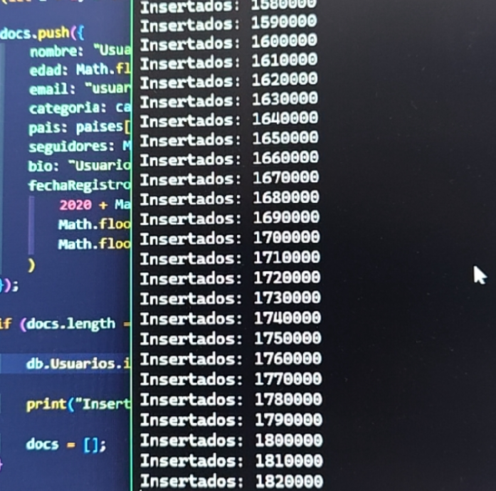

<h1 align="center">Optimización de Consultas en MongoDB usando Índices</h1>

Proyecto de análisis del impacto de los índices en el rendimiento de consultas utilizando MongoDB, Express y MongoDB Compass.

# 📌 Objetivo

El objetivo de este proyecto es analizar cómo los **índices en MongoDB** afectan el rendimiento de las consultas cuando se utilizan grandes volúmenes de datos.

Para ello se creó una colección con **5,000,000 documentos** y se realizaron consultas **antes y después de crear índices**, midiendo los tiempos de ejecución.

<h2>Evidencia de la inscerción de datos</h2>

  

